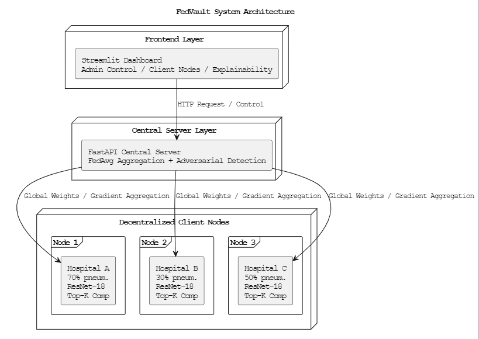

# FedVault — Privacy-Preserving Federated Learning for Healthcare AI


FedVault enables competing hospitals to collaboratively train AI models for chest X-ray classification without ever sharing patient data. Each hospital trains locally on its own private data and only transmits compressed model weight updates to a central server.

---

## What Problem Does FedVault Solve?

Hospitals hold valuable medical imaging data that could improve AI diagnostics — but privacy regulations (HIPAA, GDPR) prevent data sharing. FedVault solves this by keeping raw patient data at each hospital while allowing collaborative model improvement through federated learning.

---

## Key Features

### Federated Learning Core
- Central FastAPI aggregation server implementing FedAvg
- 3 simulated hospital nodes with independent local training
- JWT-based authentication per hospital node
- ResNet-18 (ImageNet pretrained) chest X-ray classifier
- Grad-CAM explainability overlay on X-ray predictions

### Research Contributions

**1. Adversarial Attack Detection**

Federated learning is vulnerable to data poisoning attacks where a malicious node submits corrupted weight updates to degrade the global model. FedVault addresses this by computing cosine similarity between each node's weight update and the mean update vector across all nodes. Nodes with similarity below the threshold (0.7) are flagged as potentially adversarial and logged with a security alert.

This addresses a known vulnerability in federated learning systems identified in IBM's research on FL security challenges.
Reference: https://www.ibm.com/think/topics/federated-learning

**2. Non-IID Data Distribution**

Real hospitals serve different patient populations, creating heterogeneous data distributions — a core challenge in federated learning. FedVault simulates this with:

- Node 1 (High-risk hospital): 70% pneumonia / 30% normal
- Node 2 (Low-risk hospital): 30% pneumonia / 70% normal
- Node 3 (Balanced hospital): 50% pneumonia / 50% normal

**3. Gradient Compression (Top-K Sparsification)**

To reduce communication overhead, FedVault applies top-K sparsification before transmitting weight updates. Only the top 10% of weights by absolute magnitude are transmitted — the remaining 90% are zeroed out. This reduces communication cost from ~44MB to ~4.4MB per round while preserving model quality.

---

## Tech Stack

| Layer              | Technology                                                  |
| ------------------ | ----------------------------------------------------------- |
| Backend API        | FastAPI + Uvicorn                                           |
| Machine Learning   | PyTorch + torchvision (ResNet-18)                           |
| Explainability     | Custom Grad-CAM on ResNet-18 layer4                         |
| Privacy            | Top-K gradient compression                                  |
| Security           | JWT authentication, cosine similarity adversarial detection |
| Frontend Dashboard | Streamlit + Plotly                                          |
| Image Processing   | OpenCV + Pillow                                             |
| Data               | Synthetic chest X-ray images (224x224 PNG)                  |

---

## Architecture
`


---

## How to Run Locally

### Prerequisites
- Python 3.12+
- pip

### Installation

```bash
# Clone the repository
git clone https://github.com/AyeshaKODER/fedvault.git
cd fedvault

# Install dependencies
pip install -r requirements.txt
```

### Run

Open two terminal windows:

**Terminal 1 — Start the central server:**
```bash
uvicorn server.main:app --host 127.0.0.1 --port 8000
```

**Terminal 2 — Start the dashboard:**
```bash
streamlit run app.py
```

Open your browser at **http://localhost:8502**

Click **Trigger Global Round** to start a federated training round across all 3 hospital nodes.

---

## Dashboard Overview

**Admin Control Tab**
- Current round status and accuracy metrics
- Training convergence chart
- Round history with per-round metrics
- Trigger new global rounds

**Client Nodes Tab**
- Per-hospital data distribution (Non-IID visualization)
- Security status per node (adversarial detection results)
- Cosine similarity scores per round
- Weight transmission logs

**Explainability Tab**
- Upload or select an X-ray image
- View ResNet-18 prediction with confidence score
- Grad-CAM heatmap overlay showing which regions influenced the prediction

---

## Security Model

FedVault implements cosine similarity-based adversarial detection before each aggregation round:

1. Each node's weight update is flattened into a 1D vector
2. The mean update vector across all nodes is computed
3. Cosine similarity between each node's update and the mean is calculated
4. Nodes with similarity below 0.7 are flagged as potentially adversarial
5. All security events are logged with timestamps

---

## Future Work

- Replace simulated nodes with real distributed hospital deployments
- Implement FedProx for improved Non-IID convergence
- Add Differential Privacy (Opacus) for formal privacy guarantees
- Docker containerization for scalable deployment
- Deploy on Hugging Face Spaces for public demo
- Evaluate on real NIH ChestX-ray14 dataset
- Extend to multi-disease classification beyond pneumonia
---
